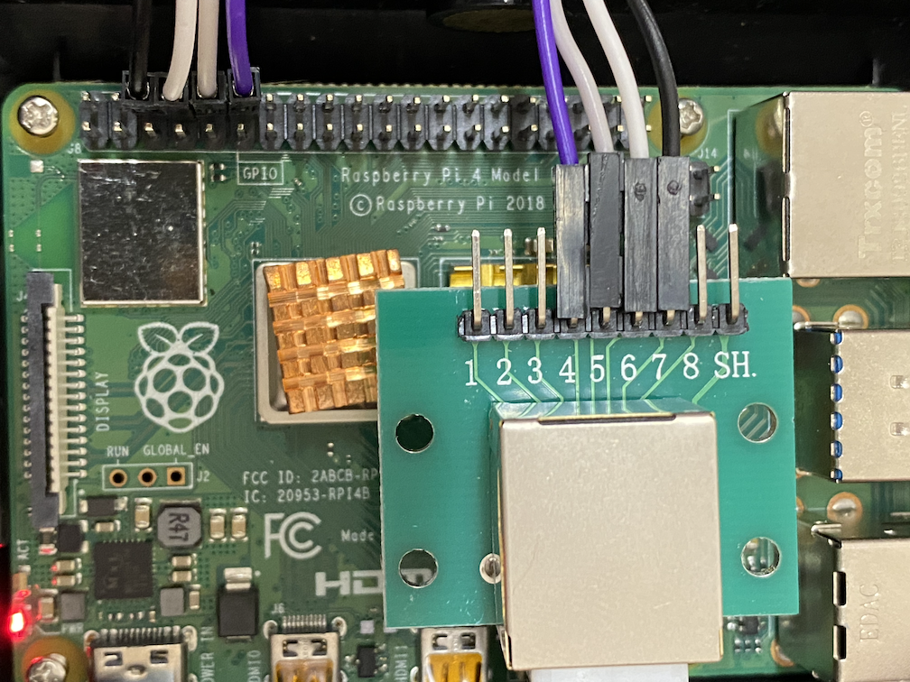

# flexispot-e7-controller

Control your Flexspot E7 programmatically. Tested on Ubuntu 22.04.3 LTS on Raspberry Pi 4.

## Usage

There are two modes to control the desk, `local` and `remote`. The `local` mode directly controls the desk from the Pi, while the `remote` mode controls the desk via a remote server which is connected to the desk.

### `local` mode

Directly control the desk from the Pi. See the "Hardware Setup" section for the connection between the Pi and the desk.

```console
$ e7c local -h
Control locally connected Flexispot

Usage: e7c local [OPTIONS] <COMMAND>

Commands:
  up     Adjust the desk upwards. If specified, adjsut upwards in centimeters. Not so accurate
  down   Adjust the desk downwards. If specified, adjsut downwards in centimeters. Not so accurate
  go     Go to the preset position [possible values: standing/preset3, sitting/preset4, preset1, preset2]
  set    Set the desk height to the specified centimeters. Not so accurate
  query  Query current height
  help   Print this message or the help of the given subcommand(s)

Options:
      --device <DEVICE>  Path to serial device [default: /dev/ttyS0]
      --pin20 <PIN20>    GPIO (BCM) number of PIN 20 [default: 12]
  -h, --help             Print help
```

### `remote` mode

Control the desk via a remote server, which is connected to the desk running on the Pi. See the "Hardware Setup" section and [web/README.md](web/README.md) for instructions.

```console
$ e7c local -h
Control Flexispot via remote server

Usage: e7c remote [OPTIONS] <COMMAND>

Commands:
  up     Adjust the desk upwards. If specified, adjsut upwards in centimeters. Not so accurate
  down   Adjust the desk downwards. If specified, adjsut downwards in centimeters. Not so accurate
  go     Go to the preset position [possible values: standing/preset3, sitting/preset4, preset1, preset2]
  set    Set the desk height to the specified centimeters. Not so accurate
  query  Query current height
  help   Print this message or the help of the given subcommand(s)

Options:
      --address <ADDRESS>  IP address of remote control server [default: 192.168.68.52]
      --port <PORT>        Port number of remote control server [default: 8000]
  -h, --help               Print help
```

## Hardware Setup

You will need following parts other than the Pi.

1. RJ45 cable, typical Ethernet cable would be enough
2. RJ45 breakout e.g. [SparkFun RJ45 Breakout - BOB-00716](https://www.sparkfun.com/products/716), where I have used [RJ 45 8ピン配線板キット](https://www.amazon.co.jp/gp/product/B0C52JCM71/) without any issue.

Connection should be straightforward.

```
Flexispot E7 controller --(RJ45)-- RJ45 breakout -- Raspberry Pi 4
```

The script expects the following connection between the breakout and the Pi.

```
  Raspberry Pi 4 pinout  | RJ45 breakout
 ------------------------+---------------
    3V3  (1) (2)  5V     |
  GPIO2  (3) (4)  5V     |
  GPIO3  (5) (6)  GND    | (7) GND
  GPIO4  (7) (8)  GPIO14 | (6) RX
    GND  (9) (10) GPIO15 | (5) TX
 GPIO17 (11) (12) GPIO18 | (4) PIN20
 GPIO27 (13) (14) GND    |
 GPIO22 (15) (16) GPIO23 |
    3V3 (17) (18) GPIO24 |
 GPIO10 (19) (20) GND    |
  GPIO9 (21) (22) GPIO25 |
 GPIO11 (23) (24) GPIO8  |
    GND (25) (26) GPIO7  |
  GPIO0 (27) (28) GPIO1  |
  GPIO5 (29) (30) GND    |
  GPIO6 (31) (32) GPIO12 |
 GPIO13 (33) (34) GND    |
 GPIO19 (35) (36) GPIO16 |
 GPIO26 (37) (38) GPIO20 |
    GND (39) (40) GPIO21 |
```



## Operating System Setup

1. You might need to enable serial connection for your pi. I'm not sure how or when I did it though.
2. Add your user to `tty` (or `dialout`, based on your setup. Please check the group with `ls -l /dev/ttyS0`) group to work with `/dev/ttyS0`, and allow the group to read/write the serial.

    ```console
    $ adduser $(whoami) tty
    $ adduser $(whoami) dialout
    $ # then log-out and -in again to activate change
    $ sudo chmod 660 /dev/ttyS0
    ```

Rebooting the Pi would reset the permission. You may have to configure systemd as below.

1. Create a systemd [path unit](https://www.freedesktop.org/software/systemd/man/latest/systemd.path.html), `/etc/systemd/system/ttyS0.path`, to monitor `/dev/ttyS0`.

    ```
    [Unit]
    Description=Make /dev/ttyS0 group writable
    
    [Path]
    PathExists=/dev/ttyS0
    Unit=ttys0.service
    
    [Install]
    WantedBy=multi-user.target
    ```

2. Create a systemd service, `/etc/systemd/system/ttyS0.service`, to act with the event.

    ```
    [Unit]
    Description=Change /dev/ttyS0 permission
    
    [Service]
    Type=simple
    ExecStart=/usr/local/bin/chgrp.sh
    
    [Install]
    WantedBy=multi-user.target
    ```

3. Create a simple shell script, `/usr/local/bin/chgrp.sh`, to change permission.

    ```
    #!/bin/sh
    
    sudo chmod g+r /dev/ttyS0
    ```

4. Enable the units.

    ```console
    $ sudo systemctl enable ttyS0.{path,service}
    ```

5. Reboot the pi and see how it works.

## Acknowledgements

- [iMicknl/LoctekMotion_IoT](https://github.com/iMicknl/LoctekMotion_IoT)
- [grssmnn/ha-flexispot-standing-desk](https://github.com/grssmnn/ha-flexispot-standing-desk)
